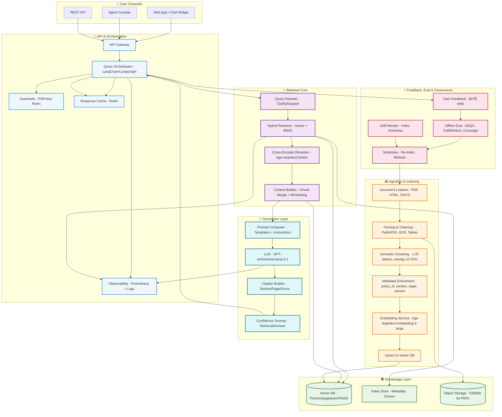
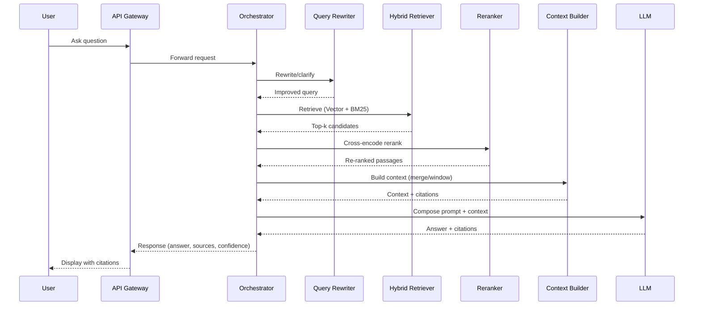

# Insurance Policy Knowledge Retrieval - RAG

## Project Summary
- Built a scalable Retrieval-Augmented Generation (RAG) pipeline to extract precise answers from 500+ page policy documents for customer service.
- Enables faster, consistent responses, reducing manual effort and improving customer satisfaction.

##  System Architecture

## Query Flow (RAG)

## Implementation Notes
- Chunking: 1,000–1,500 tokens, 10–15% overlap; section-aware; table capture where possible.
- Hybrid retrieval: Reciprocal Rank Fusion (RRF) of vector and BM25 results; rerank top 50 to top 8.
- Metadata: `policy_id`, `section_id`, `page`, `version`, `effective_date`, `jurisdiction`.
- Guardrails: PII redaction, policy scope constraints, refusal for out-of-scope queries.
- Caching: cache key = normalized_query + policy_scope + version; TTL 12–24h.
- Citations: include section title + page range + similarity score; clickable deep links.
- Evaluation: faithfulness (LLM-as-judge + string entailment), coverage, latency budgets.
- Re-indexing: scheduled on new policy versions; maintain active+shadow indexes for zero-downtime swaps.

## Suggested Stack
- Loaders: PyMuPDF, Unstructured.io
- Embeddings: `bge-large-en`, `text-embedding-3-large`, or `E5-large` via TEI
- Vector DB: pgvector (Postgres), Pinecone, or FAISS (local)
- Reranker: `bge-reranker-large` / Cohere Rerank
- Orchestration: LangChain/LangGraph, FastAPI
- LLM: GPT-4o / Gemini / Llama 3.1 (via vLLM for cost control)
- Infra: Redis cache, S3/Blob storage, Prometheus/Grafana, Docker

## Outcomes
- Precise answers from 500+ page policies with citations
- Faster, consistent customer support, reduced manual workload
- Auditable responses with source grounding and confidence scores 
