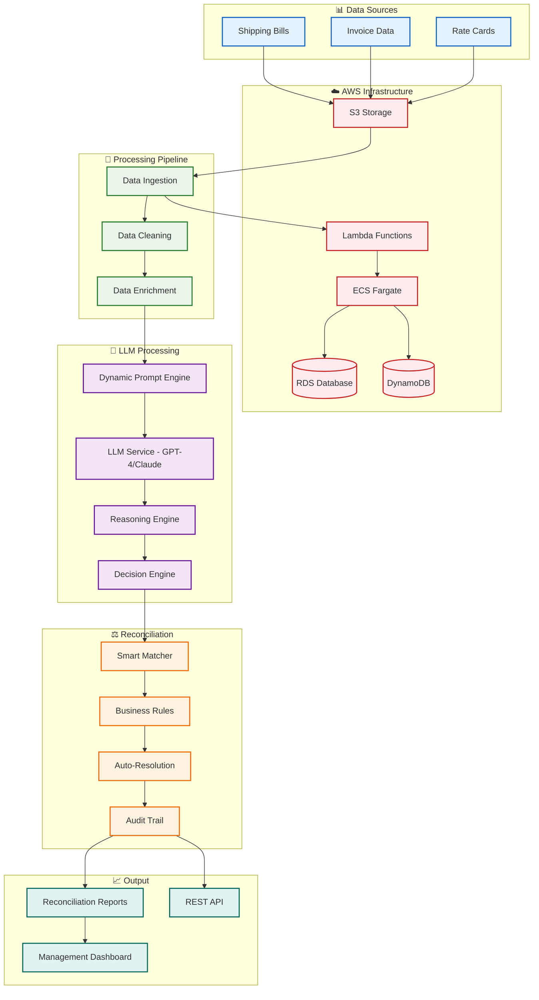

# Shipping Reconciliation Automation

- **Goal**: Automate reconciliation of thousands of shipping bills using LLM-powered logic
- **Core**: Dynamic prompt layer + LLM reasoning + business rules + automated resolution
- **Stack**: AWS (Lambda, ECS, S3, RDS, DynamoDB), Python, GPT-4/Claude, LangChain
- **Benefits**: 10x faster processing, 95% automation, 70% cost reduction, real-time visibility 
