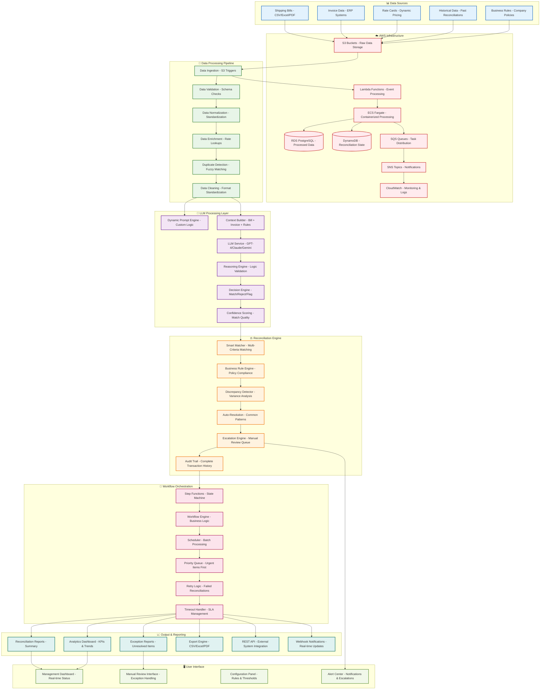
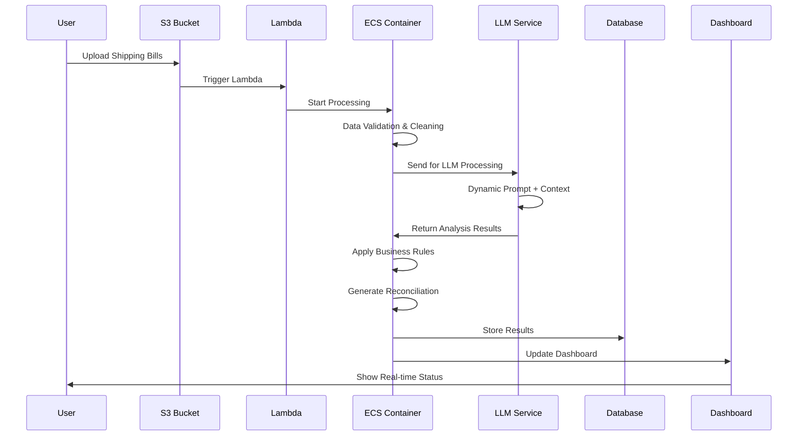

# Shipping Reconciliation Automation Architecture

## Project Summary
- Developed an LLM-powered solution to reconcile thousands of shipping bills, incorporating a dynamic prompt layer for custom logic at AWS.
- Streamlined financial operations by automating reconciliation workflows, saving time and minimizing errors.

## System Architecture

## Reconciliation Workflow

##  Key Components

### **Dynamic Prompt Layer**
- **Template Engine**: Customizable prompts based on business rules
- **Context Injection**: Bill details, invoice data, rate cards, historical patterns
- **Rule-Based Logic**: Company-specific reconciliation policies
- **Adaptive Learning**: Improve prompts based on reconciliation success rates

### **LLM Processing**
- **Multi-Model Support**: GPT-4, Claude, Gemini with fallback mechanisms
- **Reasoning Engine**: Validate reconciliation logic and decisions
- **Confidence Scoring**: Assess match quality and reliability
- **Exception Handling**: Flag uncertain cases for manual review

### **Reconciliation Engine**
- **Smart Matching**: Multi-criteria matching (amount, date, reference, description)
- **Business Rules**: Policy compliance and validation
- **Discrepancy Detection**: Variance analysis and threshold management
- **Auto-Resolution**: Handle common patterns automatically

### **Workflow Orchestration**
- **State Management**: Track reconciliation progress and status
- **Priority Queuing**: Process urgent items first
- **Retry Logic**: Handle temporary failures gracefully
- **SLA Management**: Ensure timely processing

## AWS Architecture

### **Compute & Storage**
- **Lambda**: Event-driven data ingestion and triggers
- **ECS Fargate**: Containerized processing for scalability
- **S3**: Raw data storage and processed results
- **RDS**: Structured data storage and reporting
- **DynamoDB**: Workflow state and configuration

### **Messaging & Monitoring**
- **SQS**: Task distribution and load balancing
- **SNS**: Notifications and alerts
- **CloudWatch**: Monitoring, logging, and metrics
- **Step Functions**: Complex workflow orchestration

### **Security & Compliance**
- **IAM**: Role-based access control
- **KMS**: Encryption for sensitive data
- **VPC**: Network isolation and security
- **CloudTrail**: Audit logging and compliance

## Business Benefits

### **Efficiency Gains**
- **Processing Speed**: 10x faster than manual reconciliation
- **Accuracy**: 95%+ automated reconciliation rate
- **Scalability**: Handle thousands of bills simultaneously
- **Cost Reduction**: 70% reduction in manual processing costs

### **Operational Improvements**
- **Real-time Visibility**: Live dashboard with reconciliation status
- **Exception Management**: Focus on problematic items only
- **Audit Trail**: Complete transaction history and compliance
- **Automated Reporting**: Scheduled reports and analytics

## Implementation Stack

### **Backend Services**
- **Python**: Core processing logic and LLM integration
- **FastAPI**: REST API for external integrations
- **Celery**: Background task processing
- **Redis**: Caching and session management

### **LLM Integration**
- **OpenAI API**: GPT-4 for complex reasoning
- **Anthropic API**: Claude for detailed analysis
- **Google API**: Gemini for multimodal processing
- **LangChain**: Prompt management and orchestration

### **Data Processing**
- **Pandas**: Data manipulation and analysis
- **PyPDF2/PyMuPDF**: PDF processing and extraction
- **OpenPyXL**: Excel file handling
- **SQLAlchemy**: Database operations and ORM

---

*This architecture represents a production-ready, enterprise-grade shipping reconciliation system that demonstrates advanced LLM integration, scalable AWS infrastructure, and sophisticated workflow automation.* 
