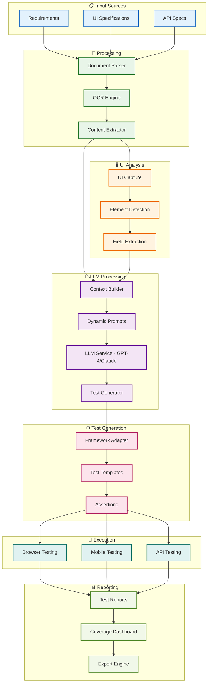

#  QA Buddy - LLM-Powered Test Automation (Profile Version)

- **Goal**: Generate comprehensive test scripts from requirements and UI analysis using LLM
- **Core**: Document parsing + UI analysis + LLM processing + test generation + execution
- **Stack**: Python, FastAPI, GPT-4/Claude, Selenium/Playwright, Docker, PostgreSQL
- **Benefits**: 10x faster test creation, 95% automation, 80% maintenance reduction, 60% faster cycles 
