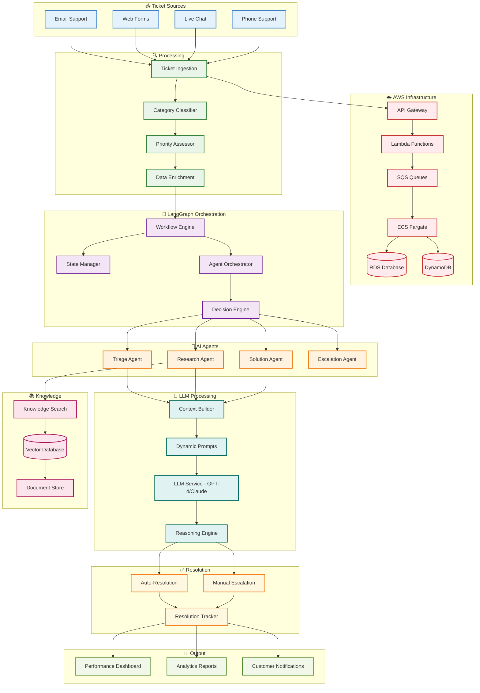

# Support Operation Automation

- **Goal**: Automate end-to-end support ticket handling using agentic workflows and LLMs
- **Core**: Multi-channel ingestion + LangGraph orchestration + AI agents + LLM processing + auto-resolution
- **Stack**: AWS (Lambda, ECS, SQS, RDS, DynamoDB), LangGraph, Python, GPT-4/Claude, LangChain
- **Benefits**: 80% faster resolution, 70% automation, 60% cost reduction, 24/7 availability 
